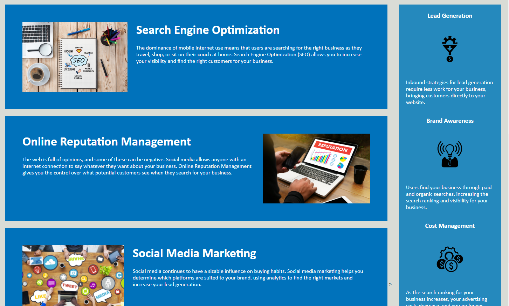

# Description
    For this project I refactored and cleaned up the code for Horiseon Digital Marketing Agency's website. I applied semantic HTML elements and reformatted the CSS stylesheet to provide better accessibility and functionality for the site. CSS comments have been added to assist future developers. The page now loads properly and the semantic flow of the source code has greatly improved.

### Screenshot
    
    

### Link
    The updated website can be found at: https://zugzw4ng.github.io/Horiseon-Repo/

